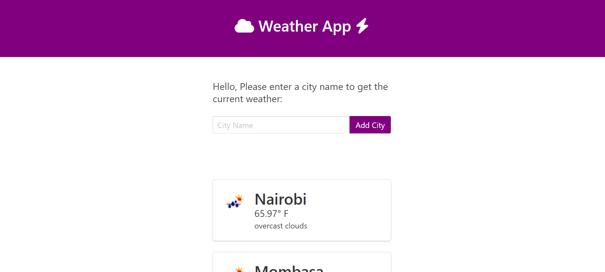

# Django Weather App

## Overview

The Django Weather App allows users to search for any city and get real-time weather updates. The app fetches weather data using the OpenWeatherMap API and displays the current temperature, weather description, and an icon representing the conditions. Users can simply input the name of a city and view its weather information.



## Features
- **City Search**: Users can enter the name of a city and get the latest weather data for that location.
- **Real-Time Data**: Weather information is fetched in real-time using the OpenWeatherMap API.
- **Temperature Display**: Shows the current temperature in imperial units (Fahrenheit).
- **Weather Description**: Displays a brief description of the current weather (e.g., "clear sky", "rain").
- **Weather Icon**: A visual icon corresponding to the weather conditions.

## Technologies Used
- **Django**: The web framework used for building the app.
- **OpenWeatherMap API**: The external API used to fetch real-time weather data.
- **HTML/CSS**: For the frontend display.
- **Requests**: Python package used for making API requests.

## Installation

### Prerequisites
- Python 3.x installed on your system
- Django installed (`pip install django`)
- OpenWeatherMap API key (You can get one by signing up on their website)

### Steps
1. Clone the repository:
   ```bash
   git clone https://github.com/yourusername/django-weather-app.git
